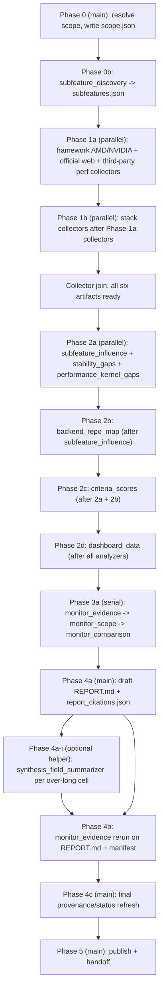

# ROCm-agent

## Purpose

Use this skill to produce a traceable AMD/ROCm vs NVIDIA/CUDA gap analysis for one inference framework and one specific feature. The output is a run directory containing verified JSON artifacts, visualization-ready dashboard data, a report citation manifest, three monitor audit files including a post-synthesis evidence rerun, a final provenance refresh, and a dashboard-style `REPORT.md` that scores only `feature_relevance` and `performance_relevance`.

## Inputs

Required:

- `framework`: an inference framework name or explicit `org/repo`.
- `feature`: the specific feature to study, such as `prefix caching`, `PD disaggregation`, `MoE expert parallelism`, `speculative decoding`, `FP8 KV cache`, or `chunked prefill`.

If either required input is missing, ask the user before collecting data.

Optional:

- `framework_repo_override`: explicit `org/repo` when the framework is not in the built-in map.
- `amd_hw_focus`: hardware filter such as `MI300X`, `MI325X`, or `MI355X`.
- `nv_hw_focus`: hardware filter such as `H100`, `H200`, `B200`, or `GB200`.
- `out_dir`: defaults to `~/research/rocm-agent/{framework}_{feature}/{YYYY-MM-DD}/`.
- `time_window_days`: PR and issue lookback, default `365`.
- `max_per_collector`: hard cap per collector artifact, default `200`.

## Framework Repo Map

- `vLLM`: `vllm-project/vllm`
- `SGLang`: `sgl-project/sglang`
- `TGI`: `huggingface/text-generation-inference`
- `TensorRT-LLM`: `NVIDIA/TensorRT-LLM`
- `llama.cpp`: `ggerganov/llama.cpp`

If `framework` is not in this map and `framework_repo_override` is absent, ask the user before Phase 0.

## Hard Rules

- Keep the work scoped to the requested `framework` and `feature`.
- **Use the best available execution mode.** Prefer parallel sub-agent mode when the host supports delegated workers; otherwise use serial fallback mode in the main agent. See `## Execution Modes`.
- **Flat delegation.** Every role under [`agents/`](/home/ziwei/.cursor/skills/rocm-agent/agents) (subfeature discovery, collectors, analyzers, monitors, the optional Phase-4 `synthesis_field_summarizer` helper) MUST NOT spawn further sub-agents. Nested delegation is not supported.
- **One artifact per role.** Each delegated worker writes exactly one artifact at the path named in its template and returns a short summary; it must not paste artifact contents back to the main agent. The Phase-4 `synthesis_field_summarizer` helper is the single documented exception: it writes no artifact and returns ONLY a single-line summary string (or the literal token `__SUMMARIZATION_FAILED__` with an explanation) for one over-long cell at a time.
- Verify every PR, issue, URL, and quote before it appears in the final report or `dashboard/dashboard_data.json`. Collectors verify 100 percent of retained entries. The initial monitor pass verifies 100 percent of dashboard refs, then a post-synthesis `monitor_evidence` rerun verifies 100 percent of final `REPORT.md` refs and `dashboard/report_citations.json` refs before publish. The 80 percent sampling rate applies only to non-cited retained evidence. Any unreachable retained ref found by monitors is a must-fix; unresolved retained evidence after two remediation rounds is `RED` and not publishable.
- Every retained collector entry MUST carry a stable `evidence_id`, every retained analysis/dashboard row MUST carry a stable `row_id`, and every downstream citation MUST point back with an exact `artifact`, JSON Pointer, `evidence_id` or `row_id`, `source_url`, `verified_state`, and quote hash when a quote exists. Do not use array indexes such as `score_rows[0]` as the only provenance key.
- Validate JSON artifacts against `/home/ziwei/.cursor/skills/rocm-agent/json-schemas/artifacts.schema.json` whenever a JSON Schema validator is available; otherwise perform the same required-field checks manually before moving to the next phase.
- Derive `subfeatures.json` before launching collectors; every subfeature needs at least one framework anchor such as a doc section, config flag, code path, symbol, or verified PR.
- Keep chip scope in the machine-readable JSON block inside `scope.md`. Phase 0 must parse that block to derive AMD and NVIDIA search scope; the human-readable vendor sections are a review mirror only. Do not duplicate chip-generation scope rules in this skill.
- Run collectors in parallel only when their input artifacts already exist. Framework AMD/NVIDIA, official web, and third-party performance collectors can run together after Phase 0b; ROCm and NVIDIA stack collectors run only after all four Phase-1a collector artifacts exist, because official-web and third-party performance artifacts may seed or confirm backend repo expansion.
- Run the three monitors serially after analysis: evidence, scope, then comparison. After report synthesis and citation-manifest generation, rerun `monitor_evidence`, then perform the finalization refresh before publish.
- Use at most two recollection rounds total across all monitors. The main agent owns `{out_dir}/remediation_state.json` and updates it before every monitor run; monitor workers read that file instead of inferring rounds from prose.
- Treat monitor `YELLOW` as requiring remediation while recollection rounds remain. After the maximum rounds, only documented non-blocking caveats may remain `YELLOW`; unresolved blocking findings are `RED` and block publishing.
- Drop unverifiable claims into artifact `_meta.dropped_unverified`; drop out-of-scope claims into `_meta.dropped_out_of_scope`; drop below-threshold analysis rows into `_meta.dropped_below_threshold`; do not loop indefinitely.
- Score only `feature_relevance` and `performance_relevance`; stability evidence feeds one of those dimensions only when it affects the requested feature or performance behavior.
- Every retained `analysis/stability_gaps.json` entry MUST carry per-side severity (`amd_severity` and `nvidia_severity` from the stability enum `none|low|medium|high|critical`); every retained `analysis/performance_kernel_gaps.json` entry MUST carry per-side integer severity (`amd_severity` and `nvidia_severity` in `[0, 5]`). Severity is independent of `confidence` and `evidence_tier`. See `criteria.md` `## Severity Rating`.
- Never truncate `REPORT.md` content with three or more consecutive dots (`...`, `....`, etc.), Unicode `…`, `[truncated]`, `<truncated>`, or any other ellipsis/elision marker outside fenced quote blocks. Use the report-template "summary plus detail" pattern: render compact tables with short non-truncating cell summaries AND a per-row detail subsection that carries the full upstream prose verbatim from `dashboard/dashboard_data.json`. The main agent MAY invoke `agents/synthesis_field_summarizer.md` once per over-long cell to produce that short summary; the helper preserves every distinct fact (refs, hardware, dtype, kernel, error class, percentage) and never drops a fact.
- Prefer `gh`, `WebSearch`, and `WebFetch` for collection. For non-`gh` sources, preserve a short verbatim quote in the relevant collector entry.
- Use consistent terminology: AMD/ROCm side, NVIDIA/CUDA side, backend-map `primary_owner`/`co_owners`/`integration_surface`, dashboard score-row `primary_amd_owner`/`primary_nvidia_owner`, and `confidence`.

## Execution Modes

**Parallel sub-agent mode (Cursor / Claude Code / any host with delegation).**
The main agent performs Phase 0 itself, then injects the matching prompt template from `agents/` into one delegated worker per role. Phase 1a launches framework AMD/NVIDIA, official web, and third-party performance collectors in one batch; Phase 1b launches the ROCm and NVIDIA stack collectors after all Phase-1a artifacts exist. Phase 2a launches three independent analyzers in one batch; remaining analyzer phases serialize on their prerequisites; Phase 3a runs the three monitors serially. Each worker writes exactly one artifact and returns a short summary.

**Serial fallback mode (Codex / any host without delegation).**
The main agent plays each role itself in the same phase order, using the agent file as a role checklist. Output paths, JSON schemas, verification gates, and re-spawn budget are unchanged. A "re-spawn" in fallback mode means re-running that role from scratch with the offending refs embedded in the prompt.

In either mode, the agent prompt template lives in `agents/{role}.md`. Roles must not spawn further sub-agents.

## Workflow Phases



In every phase below, the role file under [`agents/`](/home/ziwei/.cursor/skills/rocm-agent/agents) is the prompt template the main agent injects into the delegated worker (parallel mode) or follows as a checklist itself (serial fallback mode).

### Phase 0 - Scope resolution (main agent)

1. Normalize inputs, resolve `framework_repo` from the built-in map or `framework_repo_override`.
2. Parse the machine-readable `rocm_agent_scope.v1` JSON block in [`scope.md`](/home/ziwei/.cursor/skills/rocm-agent/scope.md) for AMD and NVIDIA (`aliases`, `product_aliases`, `search_terms`, `in_scope`, `out_of_scope_drops`, `default_scope_statement`). If `amd_hw_focus`/`nv_hw_focus` are set, narrow `effective_scope_statement`.
3. Create `{out_dir}/` and write `scope.json` per the `scope.json` schema in [`schemas.md`](/home/ziwei/.cursor/skills/rocm-agent/schemas.md).
4. Write `{out_dir}/remediation_state.json` with `max_recollection_rounds=2`, `recollection_rounds_used=0`, `rounds_remaining=2`, and `current_monitor_run_phase="initial"` per the schema in [`schemas.md`](/home/ziwei/.cursor/skills/rocm-agent/schemas.md). The main agent updates this file before every monitor run and after every remediation round.
5. Verify `scope.json.resolved.chip_scope_source == "scope.md#rocm_agent_scope.v1"` and that every required field in `chip_scope.amd` and `chip_scope.nvidia` (`aliases`, `product_aliases`, `search_terms`, `in_scope`, `out_of_scope_drops`, `default_scope_statement`) is non-empty before launching Phase 0b. A missing or empty field is a stop condition.

### Phase 0b - Subfeature discovery

Spawn one [`agents/subfeature_discovery.md`](/home/ziwei/.cursor/skills/rocm-agent/agents/subfeature_discovery.md) worker. Wait for `{out_dir}/subfeatures.json`. If empty or unanchored, surface and stop before Phase 1a.

### Phase 1a - Framework, official-web, and performance collectors

In parallel sub-agent mode, spawn these four workers in one batch; in serial fallback mode, run them one at a time. Each worker writes its single artifact under `{out_dir}/collectors/`:

- [`agents/collector_framework_amd.md`](/home/ziwei/.cursor/skills/rocm-agent/agents/collector_framework_amd.md) -> `collectors/framework_amd.json`
- [`agents/collector_framework_nvidia.md`](/home/ziwei/.cursor/skills/rocm-agent/agents/collector_framework_nvidia.md) -> `collectors/framework_nvidia.json`
- [`agents/collector_official_web.md`](/home/ziwei/.cursor/skills/rocm-agent/agents/collector_official_web.md) -> `collectors/official_web.json`
- [`agents/collector_third_party_perf.md`](/home/ziwei/.cursor/skills/rocm-agent/agents/collector_third_party_perf.md) -> `collectors/third_party_perf.json`

Wait for all four Phase-1a collectors before Phase 1b. Stop before Phase 1b or Phase 2 if any collector reports an error.

### Phase 1b - Stack collectors after framework collectors

In parallel sub-agent mode, spawn these two workers after all Phase-1a collector artifacts exist; in serial fallback mode, run them after Phase-1a outputs are written. Stack collectors may seed backend candidates from verified framework evidence, official vendor/framework web evidence, and reproducible third-party benchmark evidence, but every backend repo must still be tied to a canonical subfeature and verified before retention:

- [`agents/collector_rocm_stack.md`](/home/ziwei/.cursor/skills/rocm-agent/agents/collector_rocm_stack.md) -> `collectors/rocm_stack.json` (requires `collectors/framework_amd.json`, `collectors/official_web.json`, and `collectors/third_party_perf.json`)
- [`agents/collector_nvidia_stack.md`](/home/ziwei/.cursor/skills/rocm-agent/agents/collector_nvidia_stack.md) -> `collectors/nvidia_stack.json` (requires `collectors/framework_nvidia.json`, `collectors/official_web.json`, and `collectors/third_party_perf.json`)

Wait for all six collector artifacts to finish before Phase 2.

### Phase 2 - Analysis (parallel where independent, serial where dependent)

- Phase 2a (parallel batch on top of all six collector artifacts):
  - [`agents/analyzer_subfeature_influence.md`](/home/ziwei/.cursor/skills/rocm-agent/agents/analyzer_subfeature_influence.md) -> `analysis/subfeature_influence_matrix.json`
  - [`agents/analyzer_stability_gaps.md`](/home/ziwei/.cursor/skills/rocm-agent/agents/analyzer_stability_gaps.md) -> `analysis/stability_gaps.json`
  - [`agents/analyzer_performance_kernel_gaps.md`](/home/ziwei/.cursor/skills/rocm-agent/agents/analyzer_performance_kernel_gaps.md) -> `analysis/performance_kernel_gaps.json`
- Phase 2b (after `subfeature_influence_matrix.json`):
  - [`agents/analyzer_backend_repo_map.md`](/home/ziwei/.cursor/skills/rocm-agent/agents/analyzer_backend_repo_map.md) -> `analysis/backend_repo_map.json`
- Phase 2c (after Phase 2a + 2b):
  - [`agents/analyzer_criteria_scores.md`](/home/ziwei/.cursor/skills/rocm-agent/agents/analyzer_criteria_scores.md) -> `analysis/criteria_scores.json`
- Phase 2d (after all five analysis artifacts):
  - [`agents/analyzer_dashboard_data.md`](/home/ziwei/.cursor/skills/rocm-agent/agents/analyzer_dashboard_data.md) -> `dashboard/dashboard_data.json`

### Phase 3a - Three serial monitors

Run in order, one role per stage; gate the next stage on `GREEN`/`YELLOW`. Before each monitor run, update `remediation_state.json` with the exact `current_monitor`, `current_monitor_run_phase`, `recollection_rounds_used`, and `rounds_remaining`, then pass that file path in the role prompt:

1. [`agents/monitor_evidence.md`](/home/ziwei/.cursor/skills/rocm-agent/agents/monitor_evidence.md) -> `monitors/monitor_evidence.md`
2. [`agents/monitor_scope.md`](/home/ziwei/.cursor/skills/rocm-agent/agents/monitor_scope.md) -> `monitors/monitor_scope.md`
3. [`agents/monitor_comparison.md`](/home/ziwei/.cursor/skills/rocm-agent/agents/monitor_comparison.md) -> `monitors/monitor_comparison.md`

The post-synthesis `monitor_evidence` rerun in Phase 4b additionally rejects any three-or-more-dot ellipsis (`\.{3,}`), Unicode `…`, or explicit truncation/elision token anywhere in `REPORT.md` outside fenced quote blocks, verifies exact citation-manifest JSON pointers and row IDs, and verifies that every `tables.stability_gaps_detail` row carries `amd_severity`/`nvidia_severity` from the stability enum and every `tables.performance_gaps_detail` row carries integer `amd_severity`/`nvidia_severity` in `[0, 5]`.

Apply the bounded remediation rule: remediate `YELLOW` while rounds remain (max two), and after the cap allow only documented non-blocking caveats to stay `YELLOW`. `RED` requires re-spawning the upstream role(s) and re-running affected stages.

### Phase 4 - Synthesis, post-synthesis evidence rerun, and finalization (main agent)

1. Write a draft dashboard-style `REPORT.md` from the verified artifacts, `dashboard/dashboard_data.json`, and monitor outcomes per [`report-template.md`](/home/ziwei/.cursor/skills/rocm-agent/report-template.md). Use the "summary plus detail" pattern for every section listed in the template - compact tables with severity columns plus per-row detail subsections that carry the full upstream prose verbatim. NEVER truncate report content with three-or-more-dot ellipses (`...` or longer), `…`, or any other elision marker outside fenced quote blocks.
   - Phase 4a-i (optional helper): for each cell whose source field exceeds the cell-length budget (default `140` chars), the main agent MAY invoke [`agents/synthesis_field_summarizer.md`](/home/ziwei/.cursor/skills/rocm-agent/agents/synthesis_field_summarizer.md) ONCE per cell. The helper returns a single-line summary that preserves every distinct fact (refs, hardware, dtype, kernel, error class, percentage). The full source text remains rendered verbatim in the per-row detail subsection regardless of helper invocation. The helper does not write any artifact, does not spawn further sub-agents, and does not call `gh`/`WebFetch`. If the helper returns `__SUMMARIZATION_FAILED__`, the main agent MUST raise the cell budget or restructure the row rendering rather than silently truncate.
2. Write `dashboard/report_citations.json` per the citation manifest schema in [`schemas.md`](/home/ziwei/.cursor/skills/rocm-agent/schemas.md). Every citation ref must use stable `evidence_id`/`row_id` and exact JSON Pointer fields; array indexes alone are invalid.
3. Rerun [`agents/monitor_evidence.md`](/home/ziwei/.cursor/skills/rocm-agent/agents/monitor_evidence.md) with `remediation_state.json.current_monitor_run_phase="post_synthesis"` and append the post-synthesis verdict to `monitors/monitor_evidence.md`. The post-synthesis rerun also rejects three-or-more-dot ellipses / `…` truncation marks in `REPORT.md`, verifies exact manifest pointers and row IDs, and verifies that every `tables.stability_gaps_detail` row carries `amd_severity`/`nvidia_severity` from the stability enum and every `tables.performance_gaps_detail` row carries integer `amd_severity`/`nvidia_severity` in `[0, 5]`.
4. Finalize without changing citations: refresh `dashboard/dashboard_data.json` provenance and final status fields from `dashboard/report_citations.json` and the post-synthesis evidence verdict, then finalize the `REPORT.md` monitor verdict footer.
5. If finalization changes any report claim, cited ref, URL, quote, or `dashboard/report_citations.json` citation entry, regenerate `dashboard/report_citations.json`, rerun post-synthesis `monitor_evidence`, and repeat finalization. Do not publish with a stale citation manifest. Cap finalization re-runs at two; after two unsuccessful finalization passes, escalate to the user instead of looping.
6. Publish only when every report citation appears in the manifest, every manifest ref points to a verified collector or analysis artifact through an exact JSON Pointer plus stable ID, the post-synthesis rerun is not `RED`, the report contains no truncation markers (`...`, `....`, `…`, explicit truncation/elision tokens) outside fenced quote blocks, every stability/performance gap row carries the required severities and side-specific owner candidates, `remediation_state.json.rounds_remaining` matches the monitor history, and the monitor verdict policy allows `publishable` or `publishable-with-caveats`.

The final report must answer which backend repos influence each side, what AMD stability issues matter versus NVIDIA, what kernel or performance gaps exist, and what additional feature or performance gaps remain.

## Run Directory Layout

```text
{out_dir}/
  scope.json
  remediation_state.json
  subfeatures.json
  collectors/
    framework_amd.json
    framework_nvidia.json
    rocm_stack.json
    nvidia_stack.json
    official_web.json
    third_party_perf.json
  analysis/
    subfeature_influence_matrix.json
    backend_repo_map.json
    stability_gaps.json
    performance_kernel_gaps.json
    criteria_scores.json
  dashboard/
    dashboard_data.json
    report_citations.json
  monitors/
    monitor_evidence.md
    monitor_scope.md
    monitor_comparison.md
  REPORT.md
```

`scope.json` records resolved inputs, the framework repo, and chip scope derived from the machine-readable block in `scope.md`. `remediation_state.json` records the bounded monitor remediation budget. `subfeatures.json` is the taxonomy shared by every collector and analyzer. `dashboard/dashboard_data.json` is the visualization-ready dataset behind `REPORT.md`; its finalization refresh records citation-manifest provenance and final publish status after the post-synthesis evidence rerun. `dashboard/report_citations.json` is the post-synthesis citation manifest that proves every cited report claim maps back to verified artifacts. `monitors/monitor_evidence.md` must include the final post-synthesis rerun after `REPORT.md` and `dashboard/report_citations.json` exist.

## Reference Files

- Read [`agents/`](/home/ziwei/.cursor/skills/rocm-agent/agents) for the prompt template of each delegated role; one file per role, no nested delegation. The optional Phase-4 helper [`agents/synthesis_field_summarizer.md`](/home/ziwei/.cursor/skills/rocm-agent/agents/synthesis_field_summarizer.md) is invoked by the main agent only to compress a single over-long table cell while preserving every distinct fact; it writes no artifact and the full source prose remains rendered verbatim in the matching per-row detail subsection.
- Read `schemas.md` for JSON artifact contracts before writing collector, analyzer, dashboard, or scope artifacts.
- Read `json-schemas/artifacts.schema.json` for machine-checkable validation gates before writing collector, analyzer, dashboard, or citation artifacts.
- Read and parse the machine-readable `rocm_agent_scope.v1` JSON block in `scope.md` before deriving chip scope or hardware search terms.
- Read `collection.md` before discovering subfeatures or launching collectors.
- Read `criteria.md` before scoring `feature_relevance` or `performance_relevance`, and before assigning per-side severities on stability/performance gap entries (see `criteria.md` `## Severity Rating`).
- Read `report-template.md` before rendering `REPORT.md`. Pay special attention to the "No truncation - mandatory" rule and the "summary plus detail" pattern.

Do not inline full schemas, scoring rubrics, or the full report template in `SKILL.md`; keep this file as the orchestration layer.

## Handoff

Hand off the completed `out_dir` with dashboard-style `REPORT.md`, `scope.json`, `remediation_state.json`, `subfeatures.json`, all `collectors/` JSON artifacts, all `analysis/` JSON artifacts, finalized `dashboard/dashboard_data.json`, `dashboard/report_citations.json`, and the three monitor files. Confirm that `monitors/monitor_evidence.md` includes the post-synthesis rerun and that finalization did not change citations after that rerun. Summarize monitor verdicts, citation manifest status, dropped unverifiable/out-of-scope/below-threshold claims, top AMD blockers, top NVIDIA advantages, and the highest-impact repo owners for follow-up work.
